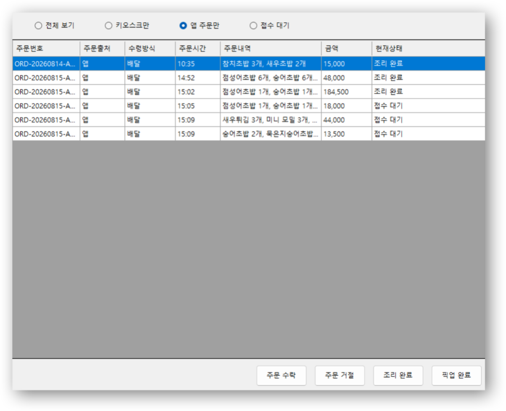
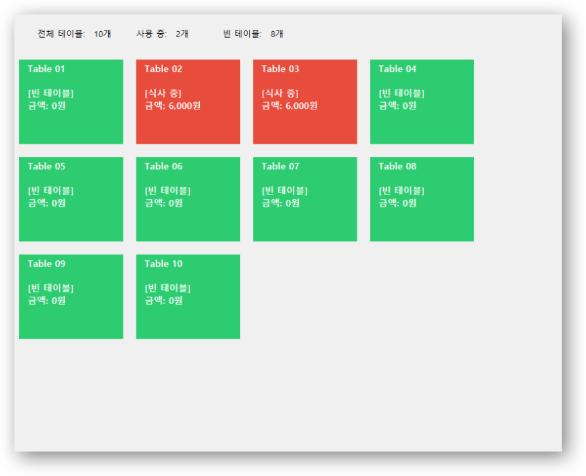
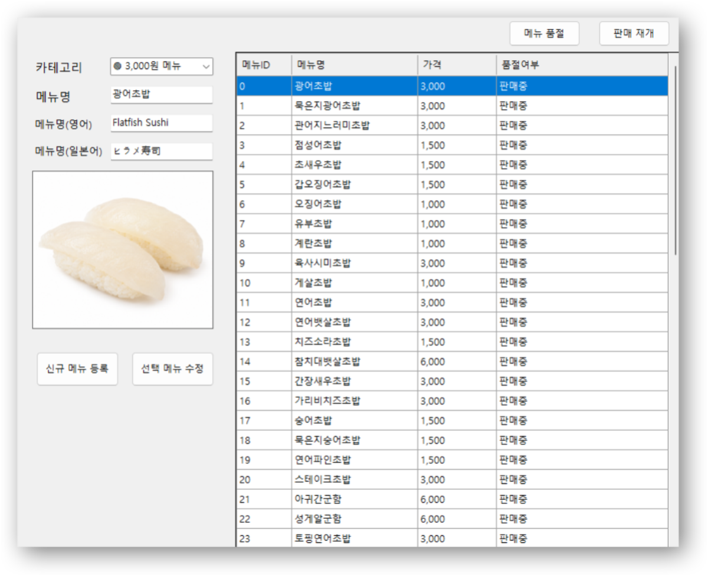
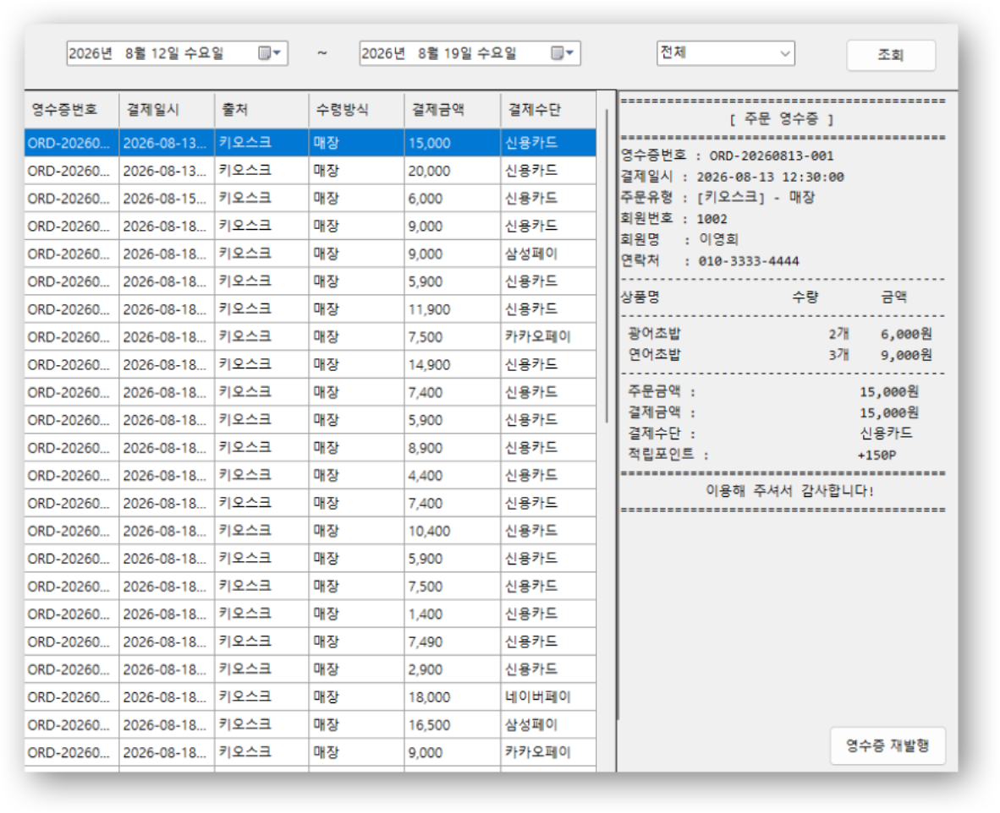
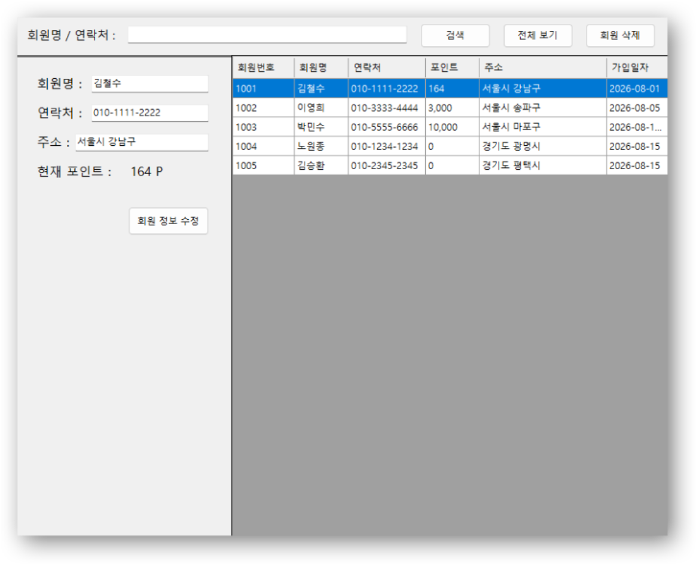
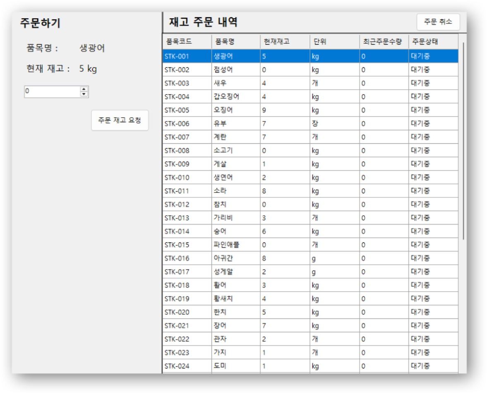
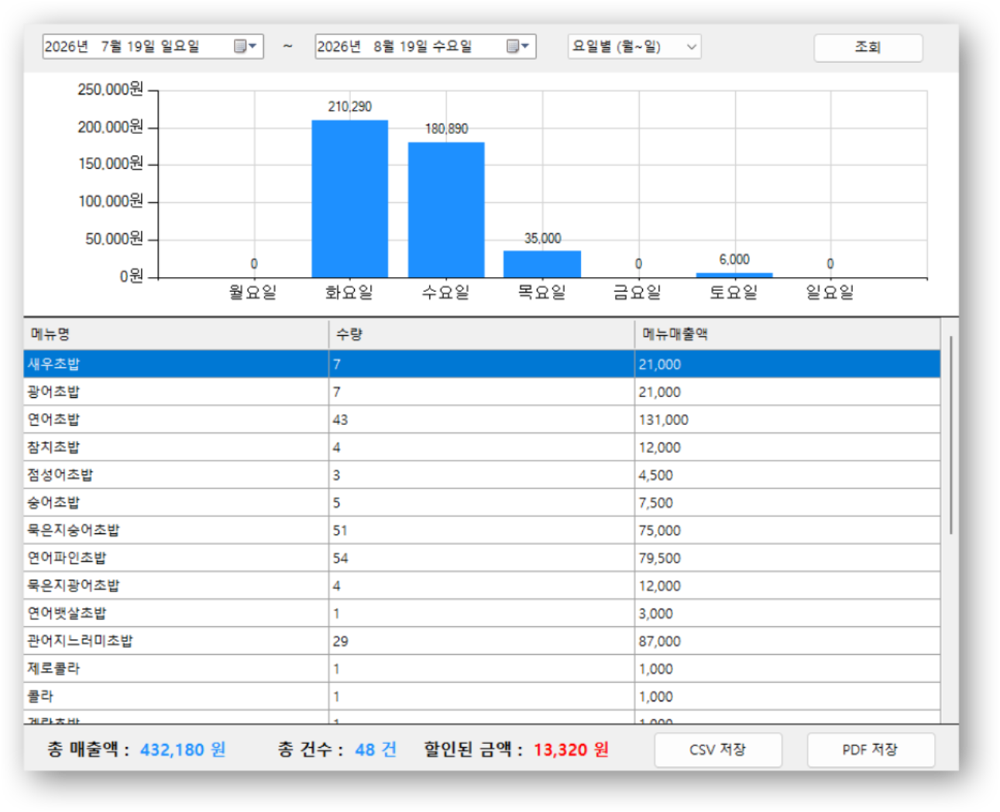

# 🖥 Sushi Store Admin System


> **C# WinForms 기반 초밥 매장 관리자 시스템**
>
> 키오스크와 모바일 앱의 주문 요청을 TCP/IP로 수신하고  
> 실시간 주문부터 회원·포인트·메뉴·재고·매출까지 관리하는  
> 초밥 매장 통합 관리자 프로그램입니다.

🏠 **[전체 팀 프로젝트 README 보기](../../tree/main)**

---

## 📑 목차

- [프로젝트 내 역할](#-프로젝트-내-역할)
- [담당 업무](#-담당-업무)
- [기술 스택](#-기술-스택)
- [시스템 구조](#-시스템-구조)
- [TCP/IP 통신](#-tcpip-통신)
- [주요 통신 Action](#-주요-통신-action)
- [주문 처리 흐름](#-주문-처리-흐름)
- [관리자 주요 기능](#-관리자-주요-기능)
- [CSV 데이터 구조](#-csv-데이터-구조)
- [핵심 구현 포인트](#-핵심-구현-포인트)
- [한계 및 개선 방향](#-한계-및-개선-방향)
- [프로젝트 회고](#-프로젝트-회고)

---

# 👩‍💻 프로젝트 내 역할

본 프로젝트는 **5인 팀 프로젝트**로 진행되었으며,  
저는 **관리자 프로그램과 관리자 TCP 서버 구현**을 담당했습니다.

관리자 프로그램은 단순한 관리 화면이 아니라  
키오스크와 모바일 앱에서 전달되는 요청을 처리하고  
주문·회원·포인트·매출 데이터를 연결하는 **중앙 처리 프로그램** 역할을 합니다.

```text
             Mobile App
                  │
                  │ TCP/IP + JSON
                  ▼
      ┌─────────────────────────┐
      │      Admin System       │
      │                         │
      │   TCP Server : 9000     │
      │                         │
      │ 주문 / 회원 / 포인트      │
      │ 메뉴 / 매출 / 테이블      │
      └────────────▲────────────┘
                   │
                   │ TCP/IP + JSON
                   │
                Kiosk
```

---

# 📌 담당 업무

### 관리자 프로그램

- C# WinForms 기반 관리자 프로그램 구현
- 실시간 주문 관리
- 테이블 현황 관리
- 메뉴 관리
- 과거 주문 및 영수증 조회
- 회원 관리
- 재고 관리
- 매출 리포트 구현

### TCP/IP 통신

- 관리자 TCP 서버 구현
- Port `9000` 기반 TCP Socket 통신
- 앱 ↔ 관리자 통신 구현
- 키오스크 ↔ 관리자 통신 구현
- UTF-8 JSON 데이터 송수신
- `Action` 기반 요청 분기
- SUCCESS / FAIL 형식의 처리 결과 반환

### 주문 및 데이터 처리

- 키오스크 주문 등록 및 결제 완료 처리
- 앱 주문 등록 및 상태 관리
- 앱 주문 수락 / 거절
- 조리 완료 / 픽업 완료 처리
- 회원 및 포인트 처리
- 매출 데이터 생성
- CSV 기반 데이터 구조 연동
- 앱·키오스크 통신 규격 설계 참여

---

# 🛠 기술 스택

| Category | Technology |
|---|---|
| Language | C# |
| GUI | Windows Forms |
| Network | TCP/IP Socket |
| Server | `TcpListener` / `TcpClient` |
| Data Format | JSON |
| JSON Library | Newtonsoft.Json |
| Encoding | UTF-8 |
| Data Storage | CSV |
| Chart | WinForms DataVisualization |
| PDF Export | iTextSharp |
| IDE | Visual Studio |
| Version Control | Git / GitHub |

---

# 🏗 시스템 구조

관리자 프로그램은 크게 **관리 UI**, **TCP 서버**,  
**주문 처리 로직**, **CSV 데이터 관리** 영역으로 구성했습니다.

```text
        ┌──────────────┐
        │  Mobile App  │
        └──────┬───────┘
               │
               │ TCP / JSON
               ▼
┌────────────────────────────────┐
│          Admin System          │
│                                │
│  ┌──────────────────────────┐  │
│  │       TCP Server         │  │
│  │        Port 9000         │  │
│  └────────────┬─────────────┘  │
│               │                │
│  ┌────────────▼─────────────┐  │
│  │     Request Routing      │  │
│  │      Action 기반 분기     │  │
│  └────────────┬─────────────┘  │
│               │                │
│  ┌────────────▼─────────────┐  │
│  │   Business Logic / CSV   │  │
│  └──────────────────────────┘  │
│                                │
│  주문 · 테이블 · 메뉴 · 회원     │
│  재고 · 과거주문 · 매출          │
└───────────────▲────────────────┘
                │
                │ TCP / JSON
        ┌───────┴───────┐
        │     Kiosk     │
        └───────────────┘
```

---

# 🌐 TCP/IP 통신

관리자 프로그램 실행 시 TCP 서버를 시작하여  
앱과 키오스크의 요청을 처리합니다.

```text
Port       : 9000
Protocol   : TCP/IP
Encoding   : UTF-8
Data Format: JSON
```

클라이언트 연결은 별도의 작업으로 처리하여  
여러 요청이 관리자 UI 동작을 직접 방해하지 않도록 구성했습니다.

## 요청 처리 과정

```text
Client
  │
  │ JSON Request
  ▼
TcpListener
  │
  ▼
TcpClient 연결
  │
  ▼
JSON 수신
  │
  ▼
JObject Parsing
  │
  ▼
Action 확인
  │
  ▼
요청별 처리 Method
  │
  ▼
CSV / 주문 / 회원 / 포인트 처리
  │
  ▼
JSON Response
  │
  ▼
Client
```

JSON의 `Action` 값을 기준으로 하나의 TCP 서버에서  
여러 종류의 요청을 분기하여 처리했습니다.

---

# 📨 주요 통신 Action

| Action | 주요 기능 |
|---|---|
| `NEW_ORDER` | 키오스크 신규 주문 등록 |
| `NEW_APP_ORDER` | 앱 신규 주문 등록 |
| `PAYMENT_COMPLETE` | 키오스크 결제 완료 처리 |
| `APP_PICKUP_COMPLETE` | 앱 픽업 완료 처리 |
| `APP_REJECT_ORDER` | 앱 주문 거절 처리 |
| `GET_ORDER_STATUS` | 앱 주문 상태 조회 |
| `REGISTER_MEMBER` | 회원가입 |
| `LOGIN_MEMBER` | 로그인 |
| `GET_MEMBER` | 회원 및 포인트 조회 |
| `GET_MENU` | 최신 메뉴 정보 조회 |

서버는 요청 처리 결과를 JSON으로 변환하여  
클라이언트에 `SUCCESS` 또는 `FAIL` 결과를 반환합니다.

---

# 🔄 주문 처리 흐름

키오스크와 모바일 앱은 **주문 및 결제 시점이 다르기 때문에**  
각각의 흐름에 맞는 처리 로직을 구현했습니다.

## 🧾 키오스크 주문

```text
Kiosk
  │
  ▼
GET_MENU
  │
  ▼
메뉴 선택
  │
  ├──── GET_MEMBER
  │       회원/포인트 조회
  ▼
NEW_ORDER
  │
  ▼
실시간 주문 등록
  │
  ▼
조리
  │
  ▼
결제
  │
  ▼
PAYMENT_COMPLETE
  │
  ▼
결제 정보 검증
  │
  ▼
ReceiptNo 생성
  │
  ▼
매출 저장
  │
  ▼
회원 포인트 처리
  │
  ▼
실시간 주문 정리
  │
  ▼
주문 완료
```

### `NEW_ORDER`

키오스크 주문을 수신하면 주문 정보를  
`susi_orders_realtime.csv`에 등록합니다.

매장 주문의 경우 `T02-01`과 같은 Identifier를 이용하여  
테이블별 주문을 구분할 수 있도록 했습니다.

### `PAYMENT_COMPLETE`

결제가 완료되면 주문 및 결제 정보를 검증하고  
최종 영수증 번호인 `ReceiptNo`를 생성합니다.

완료된 주문은 `susi_sales_history.csv`에 기록하고  
주문 상세 데이터는 최종 영수증 번호와 연결하여  
과거 주문 및 매출 조회에서 사용할 수 있도록 처리합니다.

---

# 📱 앱 주문 처리

앱 주문은 키오스크와 달리 **선결제 후 관리자 접수 방식**으로 처리합니다.

```text
App
 │
 ▼
회원 로그인
 │
 ▼
메뉴 조회
 │
 ▼
주문서 작성
 │
 ▼
선결제
 │
 ▼
NEW_APP_ORDER
 │
 ▼
접수 대기
 │
 ▼
관리자 주문 수락
 │
 ▼
조리 중
 │
 ▼
조리 완료
 │
 ▼
픽업 완료
 │
 ▼
매출 / 포인트 처리
```

### 주문 상태

```text
접수 대기
    │
    │ [주문 수락]
    ▼
조리 중
    │
    │ [조리 완료]
    ▼
조리 완료
    │
    │ [픽업 완료]
    ▼
픽업 완료
```

> `주문 수락`은 별도의 상태값이 아니라  
> 관리자가 주문을 수락하는 동작이며, 수락 후 상태가 `조리 중`으로 변경됩니다.

앱에서는 `GET_ORDER_STATUS` 요청을 이용하여  
현재 주문 상태를 조회할 수 있도록 구성했습니다.

---

## ❌ 앱 주문 거절

접수 대기 상태의 앱 주문을 관리자가 거절할 수 있습니다.

```text
접수 대기
   │
   ▼
주문 거절
   │
   ├── 진행 중 주문 정리
   ├── 주문 상세 임시정보 정리
   ├── 결제 임시정보 정리
   │
   ▼
거절 기록 저장
```

거절 주문은 `susi_order_rejections.csv`에 기록하여  
정상 매출과 분리하고 주문 상태 조회에 활용합니다.

---

# 🖥 관리자 주요 기능

## 1. 실시간 주문 관리



앱과 키오스크에서 발생한 현재 주문을 조회하고  
앱 주문의 진행 상태를 관리합니다.

### 주요 기능

- 전체 주문 조회
- 키오스크 / 앱 주문 필터링
- 주문번호 및 출처 확인
- 매장 / 포장 / 배달 구분
- 주문시간 확인
- 주문 메뉴 및 수량 확인
- 주문금액 확인
- 현재 상태 확인
- 앱 주문 수락
- 앱 주문 거절
- 조리 완료
- 픽업 완료
- 신규 앱 주문 대기 건수 표시

---

## 2. 테이블 현황



키오스크의 매장 주문 데이터를 이용하여  
총 **10개 테이블의 현재 사용 상태**를 표시합니다.

### 주요 기능

- 전체 테이블 수 표시
- 식사 중 테이블 수 표시
- 빈 테이블 수 표시
- 테이블별 사용 여부 표시
- 테이블별 주문금액 합산
- 테이블 클릭 시 주문 상세 확인
- 동일 메뉴 주문 수량 합산
- 무료/할인 수량 확인

`키오스크 + 매장` 주문의 Identifier를 이용하여  
어느 테이블에서 발생한 주문인지 구분합니다.

---

## 3. 메뉴 관리



앱과 키오스크에서 사용하는 메뉴 정보를  
관리자가 직접 관리할 수 있도록 구현했습니다.

### 주요 기능

- 메뉴 등록
- 메뉴 수정
- 메뉴 삭제
- 한글 메뉴명
- 일본어 메뉴명
- 영어 메뉴명
- 가격 관리
- 이미지 관리
- 품절 처리
- 판매 재개

변경된 메뉴 정보는 `susi_menu.csv`에 저장되고  
클라이언트가 `GET_MENU`를 요청할 때 최신 메뉴 정보를 제공합니다.

---

## 4. 과거 주문 및 영수증



정상적으로 완료된 주문의 결제 및 주문 상세정보를 조회합니다.

### 주요 기능

- 기간별 주문 조회
- 전체 / 앱 / 키오스크 필터
- 영수증번호 확인
- 결제일시 확인
- 주문 출처 확인
- 수령방식 확인
- 결제금액 확인
- 결제수단 확인
- 주문 상세 메뉴 확인
- 원주문금액 확인
- 사용 포인트 확인
- 적립 포인트 확인
- 회원번호 확인
- 영수증 상세 조회

`susi_sales_history.csv`와 `susi_order_items.csv`를 연결하여  
영수증 단위의 상세 주문정보를 구성합니다.

---

## 5. 회원 관리



회원정보와 현재 보유 포인트를 조회하고 관리합니다.

### 주요 기능

- 전체 회원 조회
- 회원명 검색
- 연락처 검색
- 회원번호 확인
- 회원정보 수정
- 회원 삭제
- 포인트 확인
- 주소 확인
- 가입일 확인

회원 데이터는 `member.csv`에서 관리하며  
비밀번호 컬럼은 관리자 목록 화면에서 표시하지 않도록 처리했습니다.

---

## 6. 재고 관리



`stock.csv`에 저장된 품목 기본정보를 불러와  
관리자 화면에서 재고 주문을 테스트할 수 있도록 구현했습니다.

### 주요 기능

- 재고 품목 조회
- 품목코드 생성
- 품목명 확인
- 관리 단위 확인
- 현재 재고 표시
- 주문 수량 입력
- 주문 요청
- 최근 주문수량 표시
- 주문 취소

### 현재 구현 방식

`stock.csv`에는 다음 기본정보만 저장됩니다.

```text
번호,품목명,단위
```

프로그램에서 번호를 이용하여 다음과 같이  
품목코드를 생성합니다.

```text
1 → STK-001
2 → STK-002
3 → STK-003
```

현재 재고와 주문상태는 프로그램 실행 시 메모리에서 관리하며,  
재고 주문 이력을 별도의 CSV에 영구 저장하는 기능은 구현하지 않았습니다.

---

## 7. 매출 리포트



완료된 주문 데이터를 기반으로  
매장의 매출을 집계하고 시각화합니다.

### 주요 기능

- 조회 기간 설정
- 메뉴별 판매수량 집계
- 메뉴별 매출액 집계
- 요일별 매출 차트
- 주차별 매출 차트
- 월별 매출 차트
- 총 매출액 계산
- 총 주문 건수 계산
- 총 할인금액 계산
- CSV 내보내기
- PDF 내보내기

### 할인금액

총 할인금액은 다음 두 항목을 합산하여 계산합니다.

```text
메뉴 할인금액
= 할인수량 × 단가

총 할인금액
= 메뉴 할인금액 + 사용 포인트
```

---

# 💾 CSV 데이터 구조

프로젝트에서는 주문·회원·메뉴·매출 데이터를  
**CSV 파일 기반으로 분리하여 관리**했습니다.

## CSV 구성

| 파일 | 역할 |
|---|---|
| `susi_orders_realtime.csv` | 현재 진행 중 주문 |
| `susi_sales_history.csv` | 완료된 매출 및 영수증 |
| `susi_order_items.csv` | 주문별 상세 메뉴 |
| `susi_order_payments.csv` | 진행 중 앱 주문의 결제 임시정보 |
| `susi_order_rejections.csv` | 거절된 앱 주문 |
| `susi_menu.csv` | 메뉴 기본정보 |
| `member.csv` | 회원 및 포인트 |
| `stock.csv` | 재고 품목 기본정보 |

---

## 1. `susi_orders_realtime.csv`

현재 진행 중인 주문을 저장합니다.

```text
Identifier,Source,OrderType,OrderTime,TotalAmount,Status
```

| Field | 설명 |
|---|---|
| Identifier | 주문 식별자 |
| Source | `키오스크` / `앱` |
| OrderType | `매장` / `포장` / `배달` |
| OrderTime | 주문 접수 시각 |
| TotalAmount | 포인트 사용 전 주문금액 |
| Status | 현재 주문 상태 |

예시:

```text
T02-01,키오스크,매장,2026-08-14 10:00:00,12000,조리 중
ORD-20260814-APP01,앱,포장,2026-08-14 10:30:00,20000,접수 대기
```

---

## 2. `susi_sales_history.csv`

정상 완료된 매출과 영수증 정보를 저장합니다.

```text
ReceiptNo,PaymentDate,Source,OrderType,OriginalAmount,UsedPoint,TotalAmount,EarnedPoint,MemberId,PaymentMethod
```

| Field | 설명 |
|---|---|
| ReceiptNo | 최종 영수증 번호 |
| PaymentDate | 결제 / 픽업 완료 시각 |
| Source | `키오스크` / `앱` |
| OrderType | `매장` / `포장` / `배달` |
| OriginalAmount | 포인트 사용 전 금액 |
| UsedPoint | 사용 포인트 |
| TotalAmount | 실제 결제금액 |
| EarnedPoint | 적립 포인트 |
| MemberId | 회원번호, 비회원은 `0` |
| PaymentMethod | 결제수단 |

```text
TotalAmount = OriginalAmount - UsedPoint
```

회원 주문의 적립 포인트는 실제 결제금액을 기준으로 계산하며,  
비회원 주문은 포인트를 적립하지 않습니다.

---

## 3. `susi_order_items.csv`

주문별 상세 메뉴를 저장합니다.

```text
KeyId,MenuName,Price,Quantity,DiscountQty,SubTotal
```

| Field | 설명 |
|---|---|
| KeyId | 주문 연결키 |
| MenuName | 메뉴명 |
| Price | 단가 |
| Quantity | 주문 수량 |
| DiscountQty | 무료 / 할인 수량 |
| SubTotal | 해당 메뉴의 실제 결제 대상 금액 |

```text
SubTotal = (Quantity - DiscountQty) × Price
```

키오스크 주문의 경우 결제 전에는 테이블 주문 Identifier를 사용하고,  
결제 완료 후 최종 `ReceiptNo`와 연결합니다.

예시:

```text
T02-01,광어초밥,3000,3,1,6000
```

---

## 4. `susi_order_payments.csv`

진행 중인 **앱 주문의 회원·포인트·선결제 임시정보**를 저장합니다.

```text
Identifier,MemberId,UsedPoint,EarnedPoint,PaymentMethod
```

| Field | 설명 |
|---|---|
| Identifier | 앱 주문번호 |
| MemberId | 회원번호 |
| UsedPoint | 사용 포인트 |
| EarnedPoint | 적립 예정 포인트 |
| PaymentMethod | 결제수단 |

예시:

```text
ORD-20260814-APP01,1001,2000,180,앱선결제
```

---

## 5. `susi_order_rejections.csv`

관리자가 거절한 앱 주문을 기록합니다.

```text
Identifier,RejectDate,Source,OrderType
```

| Field | 설명 |
|---|---|
| Identifier | 거절된 앱 주문번호 |
| RejectDate | 거절 시각 |
| Source | `앱` |
| OrderType | `포장` / `배달` |

거절 주문은 정상 매출 데이터에는 포함하지 않습니다.

---

## 6. `susi_menu.csv`

메뉴 기본정보를 저장합니다.

```text
MenuId,KoreanName,JapaneseName,EnglishName,Price,SaleStatus,ImageFile
```

| Field | 설명 |
|---|---|
| MenuId | 메뉴 고유번호 |
| KoreanName | 한글 메뉴명 |
| JapaneseName | 일본어 메뉴명 |
| EnglishName | 영어 메뉴명 |
| Price | 메뉴 가격 |
| SaleStatus | `판매중` / `품절` |
| ImageFile | 메뉴 이미지 파일명 |

---

## 7. `member.csv`

회원정보와 현재 보유 포인트를 저장합니다.

```text
MemberId,MemberName,Phone,Password,Point,Address,JoinDate
```

| Field | 설명 |
|---|---|
| MemberId | 회원 고유번호 |
| MemberName | 회원명 |
| Phone | 연락처 |
| Password | 비밀번호 |
| Point | 현재 보유 포인트 |
| Address | 주소 |
| JoinDate | 가입일 |

---

## 8. `stock.csv`

재고 관리 화면에서 사용할 품목 기본정보를 저장합니다.

```text
Index,ItemName,Unit
```

| Field | 설명 |
|---|---|
| Index | 품목 번호 |
| ItemName | 품목명 |
| Unit | 관리 단위 |

프로그램에서는 `Index`를 이용하여  
`STK-001` 형태의 품목코드를 생성합니다.

> 현재재고, 최근주문수량, 주문상태는 `stock.csv`에 저장하지 않으며  
> 현재 프로그램 실행 중의 DataTable에서 관리합니다.

---

# 🔗 CSV 데이터 흐름

```text
                       주문 발생
                           │
              ┌────────────┴────────────┐
              │                         │
           Kiosk                       App
              │                         │
              └────────────┬────────────┘
                           ▼
               susi_orders_realtime.csv
                    진행 중 주문
                           │
                 ┌─────────┴─────────┐
                 │                   │
              정상 완료            앱 주문 거절
                 │                   │
                 ▼                   ▼
     susi_sales_history.csv   susi_order_rejections.csv
           완료 매출                거절 기록
                 │
                 ▼
        과거 주문 / 매출 리포트


주문 상세 ────────→ susi_order_items.csv

앱 결제 임시정보 ─→ susi_order_payments.csv

메뉴 정보 ────────→ susi_menu.csv

회원 / 포인트 ────→ member.csv

재고 기본정보 ────→ stock.csv
```

---

# 💡 핵심 구현 포인트

## 1. 관리자 프로그램을 TCP 서버로 구성

별도의 서버 프로그램을 추가하지 않고  
관리자 WinForms 프로그램이 직접 TCP 서버 역할을 수행하도록 구현했습니다.

```text
             Admin
          TCP Server
          Port 9000
          /       \
         /         \
      Kiosk        App
```

클라이언트 연결을 별도의 Task에서 처리하여  
네트워크 요청과 관리자 UI를 분리했습니다.

---

## 2. Action 기반 요청 분기

서로 다른 클라이언트에서 발생하는 요청을  
하나의 서버에서 처리하기 위해 JSON의 `Action` 값을 사용했습니다.

```text
JSON Request
     │
     ▼
Action
     │
     ├── NEW_ORDER
     ├── NEW_APP_ORDER
     ├── PAYMENT_COMPLETE
     ├── GET_ORDER_STATUS
     ├── REGISTER_MEMBER
     ├── LOGIN_MEMBER
     ├── GET_MEMBER
     └── GET_MENU
```

이를 통해 새로운 요청이 필요한 경우에도  
Action과 처리 로직을 추가할 수 있는 구조로 구성했습니다.

---

## 3. 키오스크와 앱의 서로 다른 주문 흐름 처리

```text
[Kiosk]

주문
 ↓
조리
 ↓
결제
 ↓
완료


[App]

선결제
 ↓
접수 대기
 ↓
관리자 수락
 ↓
조리 중
 ↓
조리 완료
 ↓
픽업 완료
```

두 프로그램의 결제 및 주문 처리 시점이 다르기 때문에  
`Source`, `OrderType`, `Status` 등을 이용하여  
각 주문 흐름을 구분했습니다.

---

## 4. 실시간 주문과 완료 주문 분리

현재 처리 중인 주문과 완료된 주문을  
별도의 CSV로 관리했습니다.

```text
susi_orders_realtime.csv
          │
          │ 주문 완료
          ▼
susi_sales_history.csv
```

이를 통해 실시간 주문 화면에서는 현재 처리해야 할 주문만 표시하고,  
완료된 주문은 과거 주문과 매출 리포트에서 조회할 수 있도록 구성했습니다.

---

## 5. 주문 데이터를 식별자로 연결

주문 데이터가 여러 CSV에 분리되어 있기 때문에  
Identifier 또는 ReceiptNo를 연결키로 사용했습니다.

```text
주문
 │
 ├── realtime
 ├── items
 └── payments

       ↓ 주문 완료

ReceiptNo
 │
 ├── sales_history
 └── order_items
```

이를 통해 관계형 데이터베이스를 사용하지 않는 환경에서도  
주문과 상세 메뉴, 결제정보를 연결할 수 있도록 구성했습니다.

---

## 6. 주문 완료 시 여러 데이터 연계 처리

하나의 주문이 완료될 때 주문 상태만 변경하는 것이 아니라  
관련된 여러 데이터를 함께 처리하도록 구현했습니다.

```text
주문 완료
   │
   ├── 주문 정보 확인
   ├── 결제 정보 확인
   ├── 매출 데이터 생성
   ├── 회원 포인트 처리
   ├── 주문 상세 연결
   └── 실시간 데이터 정리
```

---

## 7. CSV 변경사항 자동 반영

일부 관리자 화면에서는 CSV 파일의 수정 시간을 확인하여  
외부 프로그램에서 데이터가 변경된 경우 화면에 반영할 수 있도록 구성했습니다.

이를 통해 키오스크나 앱의 요청으로 CSV 데이터가 변경된 뒤  
관리자 화면에서도 최신 데이터를 확인할 수 있도록 했습니다.

---

# ⚠️ 한계 및 개선 방향

## 1. CSV → 관계형 데이터베이스

현재 프로젝트에서는 프로젝트 규모와 학습 목적을 고려하여  
CSV 파일을 데이터 저장소로 사용했습니다.

실제 서비스 환경에서는 MySQL 등의 관계형 데이터베이스를 적용하여  
다음 부분을 개선할 수 있습니다.

- 데이터 관계 관리
- 트랜잭션
- 동시 접근 안정성
- 데이터 무결성
- 검색 성능
- 백업 및 복구

---

## 2. 재고 데이터 영구 저장

현재 `stock.csv`는 품목의 기본정보만 저장하며  
현재재고와 주문상태는 프로그램 실행 중 메모리에서 관리합니다.

따라서 프로그램을 다시 실행해도 유지되는 구조로 개선하려면  
재고 수량과 입출고 이력을 별도의 데이터로 저장할 필요가 있습니다.

또한 메뉴별 사용 재료를 연결하면 다음과 같이 확장할 수 있습니다.

```text
주문 완료
   ↓
판매 메뉴 확인
   ↓
레시피 조회
   ↓
사용 재료 계산
   ↓
재고 자동 차감
   ↓
안전재고 확인
   ↓
부족 재고 알림
```

---

## 3. 네트워크 안정성 강화

현재 TCP 서버에서는 Timeout과 최대 메시지 크기를 설정하고  
JSON 형식을 확인하여 요청을 처리합니다.

실제 서비스 환경으로 확장한다면 다음 기능을 추가할 수 있습니다.

- Request ID
- 중복 요청 방지
- 재전송 정책
- 서버 장애 복구
- 통신 로그 저장
- 클라이언트 인증
- 연결 상태 모니터링

---

## 4. 데이터 보안 강화

현재 프로젝트는 교육 목적의 로컬 환경을 기준으로 구현했습니다.

실제 서비스에서는 다음과 같은 보완이 필요합니다.

- 비밀번호 Hash 처리
- 개인정보 암호화
- TLS 기반 통신
- 관리자 인증
- 권한 관리
- 중요정보 접근 제어

---

# 📝 프로젝트 회고

이번 프로젝트를 통해 단순한 WinForms 화면 구현을 넘어  
**여러 프로그램이 네트워크를 통해 하나의 시스템으로 동작하는 구조**를 경험했습니다.

특히 관리자 프로그램이 TCP 서버 역할을 담당하도록 구현하면서  
`TcpListener`, `TcpClient`, JSON 직렬화 및 역직렬화,  
요청과 응답 구조에 대해 학습할 수 있었습니다.

키오스크와 앱은 주문 방식과 결제 시점이 서로 달랐기 때문에  
하나의 처리 방식으로 구현하기 어려웠습니다.  
이를 해결하기 위해 주문의 출처와 상태를 구분하고  
각 주문 흐름에 맞는 처리 로직을 구성했습니다.

또한 주문 하나가 완료될 때 실시간 주문, 주문 상세, 결제,  
회원 포인트, 매출 등 여러 데이터가 함께 변경된다는 점을 고려하면서  
개별 기능뿐만 아니라 **전체 데이터 흐름을 설계하는 경험**을 할 수 있었습니다.

팀원들과 앱·키오스크의 JSON 요청 형식과 통신 규격을 맞추고  
실제 프로그램 간 연동 과정에서 발생한 문제를 해결하면서  
**TCP/IP 통신과 시스템 통합의 중요성**을 배울 수 있었습니다.

---

# 📂 관리자 프로그램 구성

```text
Admin
│
├── MainAdminForm
│   ├── TCP Server
│   ├── 주문 처리
│   ├── 결제 처리
│   ├── 회원 요청 처리
│   └── 메뉴 요청 처리
│
├── UcOrderBoard
│   └── 실시간 주문 관리
│
├── UcTableMonitor
│   └── 테이블 현황
│
├── UcMenuManagement
│   └── 메뉴 관리
│
├── UcOrderHistory
│   └── 과거 주문 / 영수증
│
├── UcUserManagement
│   └── 회원 관리
│
├── UcStockManagement
│   └── 재고 관리
│
└── UcSalesReport
    └── 매출 리포트
```

---

# 🔗 전체 프로젝트

이 브랜치는 초밥 매장 통합 관리 시스템 팀 프로젝트 중  
**관리자 프로그램을 담당하는 `admin` 브랜치**입니다.

키오스크, 모바일 앱, 사용자 프로그램, 웨이팅 프로그램을 포함한  
전체 프로젝트 구성은 `main` 브랜치에서 확인할 수 있습니다.

### 🏠 [전체 프로젝트 README 보기](../../tree/main)

---

<p align="center">
  <b>Sushi Store Admin System</b><br>
  C# WinForms · TCP/IP · JSON · CSV
</p>
