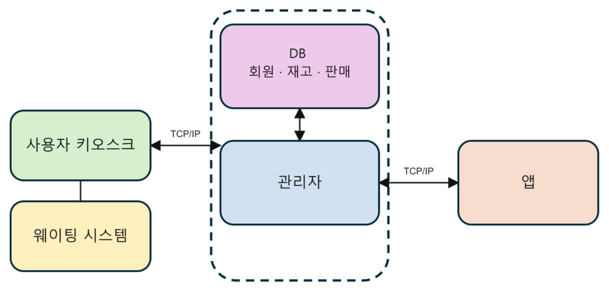

# 🍣 Sushi Store Management System


> **C# WinForms 기반 초밥 매장 통합 주문·관리 시스템**
>
> 키오스크, 사용자 프로그램, 모바일 앱, 웨이팅 프로그램,
> 관리자 프로그램을 연동하여 매장의 주문부터 결제 및 운영 관리까지
> 하나의 시스템으로 구현한 팀 프로젝트입니다.

---

## 📑 목차

- [프로젝트 소개](#-프로젝트-소개)
- [기술 스택](#-기술-스택)
- [전체 시스템 구성](#-전체-시스템-구성)
- [프로그램 구성](#-프로그램-구성)
- [브랜치 바로가기](#-브랜치-바로가기)
- [주요 시스템 흐름](#-주요-시스템-흐름)
- [팀 구성 및 역할](#-팀-구성-및-역할)
- [프로젝트 구조](#-프로젝트-구조)

---

# 📌 프로젝트 소개

초밥 매장의 실제 운영 환경을 가정하여 여러 프로그램을 하나의 시스템으로 연동한 프로젝트입니다.

고객의 주문부터 관리자 주문 처리, 결제, 회원·포인트 관리,
웨이팅 및 매출 관리까지 매장에서 발생하는 주요 업무 흐름을 구현했습니다.

```text
고객
 │
 ├── 매장 주문 ──→ 사용자 / 키오스크
 │
 └── 모바일 주문 ──→ App
                       │
                       ▼
                관리자 시스템
                 TCP Server
                       │
         ┌─────────────┼─────────────┐
         ▼             ▼             ▼
       주문          회원/포인트      매출
```

각 프로그램은 담당자별 브랜치에서 독립적으로 개발하고,
필요한 프로그램 간 데이터는 TCP/IP 및 JSON 등을 이용하여 연동했습니다.

---

# 🛠 기술 스택

| Category | Technology |
|---|---|
| Language | C# |
| Desktop GUI | Windows Forms |
| Network | TCP/IP Socket |
| Data Format | JSON |
| Encoding | UTF-8 |
| Data Storage | CSV |
| External API | SOLAPI SMS API |
| IDE | Visual Studio |
| Version Control | Git / GitHub |

---

# 🏗 전체 시스템 구성



전체 시스템은 기능에 따라 프로그램을 분리하여 구현했습니다.

- **사용자 프로그램** : 매장 주문 과정 처리
- **키오스크 프로그램** : 메뉴 선택, 주문 및 결제
- **모바일 앱** : 회원가입·로그인, 메뉴 조회 및 모바일 주문
- **관리자 프로그램** : 주문 처리 및 매장 운영 데이터 관리
- **웨이팅 프로그램** : 대기 고객 및 입장 순서 관리

관리자 프로그램은 TCP 서버 역할을 수행하며
앱과 키오스크에서 전달되는 주요 요청을 처리합니다.

---

# 🧩 프로그램 구성

## 🧾 사용자 프로그램

매장에서 고객이 주문을 진행할 수 있도록 구현한 프로그램입니다.

### 주요 기능

- 매장 / 포장 선택
- 메뉴 조회 및 선택
- 장바구니
- 회원 조회
- 포인트 사용
- 결제 과정
- 다국어 처리
- 관리자 시스템과 주문 데이터 연동

➡️ **[`user` 브랜치에서 코드 보기](../../tree/user)**

---

## 🖥 키오스크 프로그램

고객의 메뉴 주문과 결제를 처리하고
관리자 시스템 및 웨이팅 시스템과 연동됩니다.

### 주요 기능

- 메뉴 조회
- 메뉴 선택 및 주문
- 회원 조회
- 포인트 사용
- 매장 / 포장 주문
- 결제
- 관리자 서버로 주문 전송
- 결제 완료 처리
- 테이블 상태 연동

➡️ **[`키오스크` 브랜치에서 코드 보기](../../tree/키오스크)**

---

## 📱 모바일 앱

매장 방문 전 모바일 환경에서 주문할 수 있도록 구현했습니다.

### 주요 기능

- 회원가입
- 로그인
- 메뉴 조회
- 모바일 주문
- 선결제 주문 전송
- 주문 상태 조회
- 포인트 조회

➡️ **[`app` 브랜치에서 코드 보기](../../tree/app)**

---

## ⏳ 웨이팅 프로그램

매장이 만석일 경우 대기 고객을 관리하고
빈 테이블 발생 시 대기 순서를 갱신합니다.

### 주요 기능

- 대기 고객 등록
- 중복 등록 방지
- 대기 순번 관리
- 테이블 상태 확인
- 빈 테이블 발생 감지
- 입장 안내
- SOLAPI SMS 알림

➡️ **[`waiting` 브랜치에서 코드 보기](../../tree/waiting)**

---

## ⚙️ 관리자 프로그램

앱과 키오스크에서 발생한 주문을 처리하고
매장 운영에 필요한 데이터를 통합 관리합니다.

### 주요 기능

- TCP Server
- 실시간 주문 관리
- 앱 주문 상태 관리
- 테이블 현황
- 메뉴 관리
- 과거 주문 및 영수증
- 회원 및 포인트 관리
- 재고 관리
- 매출 리포트
- CSV 기반 데이터 관리

➡️ **[`admin` 브랜치에서 코드 및 상세 README 보기](../../tree/admin)**

---

# 🌿 브랜치 바로가기

프로그램별 담당 영역을 분리하여 브랜치 단위로 개발했습니다.

| Branch | 담당 프로그램 | 바로가기 |
|---|---|---|
| `admin` | 관리자 프로그램 | **[Admin →](../../tree/admin)** |
| `app` | 모바일 앱 | **[App →](../../tree/app)** |
| `user` | 사용자 프로그램 | **[User →](../../tree/user)** |
| `waiting` | 웨이팅 프로그램 | **[Waiting →](../../tree/waiting)** |
| `키오스크` | 키오스크 프로그램 | **[Kiosk →](../../tree/키오스크)** |

> 각 브랜치에서 담당 프로그램의 실제 소스 코드를 확인할 수 있습니다.

---

# 🔄 주요 시스템 흐름

## 매장 주문

```text
사용자 / 키오스크
       │
       ▼
    메뉴 선택
       │
       ▼
    주문 생성
       │
       ▼
 관리자 TCP Server
       │
       ▼
   실시간 주문
       │
       ▼
      조리
       │
       ▼
      결제
       │
       ▼
   주문 완료
       │
       ├── 회원 / 포인트
       ├── 과거 주문
       └── 매출
```

## 모바일 주문

```text
App
 │
 ▼
로그인 / 메뉴 조회
 │
 ▼
선결제
 │
 ▼
주문 전송
 │
 ▼
관리자 시스템
 │
 ▼
접수 대기
 │
 ▼
주문 수락
 │
 ▼
조리 중
 │
 ▼
조리 완료
 │
 ▼
픽업 완료
```

## 웨이팅

```text
웨이팅 등록
    │
    ▼
대기열 등록
    │
    ▼
테이블 상태 확인
    │
    ▼
빈 테이블 발생
    │
    ▼
대기 순번 변경
    │
    ▼
SMS 알림
```

---

# 👥 팀 구성 및 역할

본 프로젝트는 **5인 팀 프로젝트**로 진행했습니다.

| 이름 | 역할 | 주요 담당 |
|---|---|---|
| 홍석민 | 팀장 | 프로젝트 설계, 데이터 구조 및 통신 시스템 설계 |
| 조시현 | 부팀장 | 관리자 프로그램, TCP 서버, 주문 처리, 회원·포인트·매출 처리 |
| 김승환 | 팀원 | 사용자 프로그램 일부, 웨이팅 프로그램 및 SMS 연동 |
| 노원종 | 팀원 | 모바일 앱 프로그램 |
| 함동윤 | 팀원 | 사용자 프로그램 일부, 다국어 처리 및 웨이팅 구조 설계 |

각 담당자는 개별 프로그램을 구현하면서
통신 규격과 데이터 구조를 맞추어 전체 시스템을 연동했습니다.

---

# 📂 프로젝트 구조

```text
Sushi Store Management System
│
├── main
│   │
│   ├── README.md
│   │
│   └── docs/
│       └── images/
│           └── system-architecture.png
│
├── admin
│   └── 관리자 프로그램
│
├── app
│   └── 모바일 앱
│
├── user
│   └── 사용자 프로그램
│
├── waiting
│   └── 웨이팅 프로그램
│
└── 키오스크
    └── 키오스크 프로그램
```

---

## 🔎 Source Code

각 프로그램의 실제 구현 코드는 담당 브랜치에서 확인할 수 있습니다.

**[Admin](../../tree/admin)** ·
**[App](../../tree/app)** ·
**[User](../../tree/user)** ·
**[Waiting](../../tree/waiting)** ·
**[Kiosk](../../tree/키오스크)**

---

<p align="center">
  <b>C# WinForms · TCP/IP · JSON · CSV 기반 초밥 매장 통합 관리 시스템</b>
</p>
